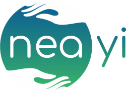
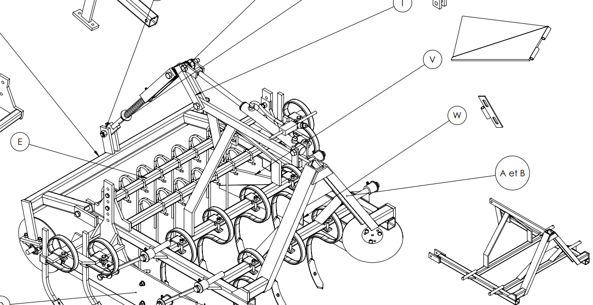
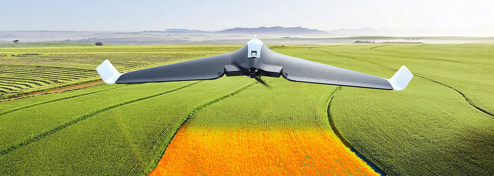
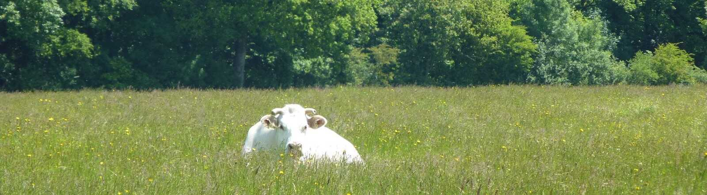
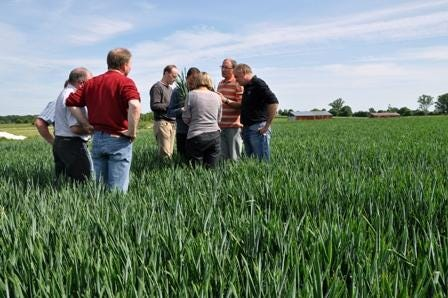

In [our previous article](/en/about/our-beliefs/), we described how we see the farming world.

## Neayi

Neayi means "new earth" in modern Greek (νέα γη). This earth, Gaia, nurturing, maternal, primordial, whose importance we have forgotten to the point of exploiting it beyond what it can bear…

Our logo shows this earth held by two hands. We cannot quite tell whether they are comforting it or, like a modern Atlas, holding it up so that it does not collapse.

The hands are transparent, because Neayi works with the intangible: thought, knowledge, collective intelligence.

Finally, the logo is blue and green, the colours of life, water and sky, the essential components of our ecology (from the Greek οἶκος / oikos, "house, habitat", and λόγος / lógos, "discourse"): knowledge of our home, so that we can live in better harmony with this earth and with nature.

## Triple performance

Triple performance means aiming for environmental, economic and social performance at the same time. It is also a line of thinking the whole farming sector has been pursuing for about ten years, looking for a new direction after 50 years of largely productivist agricultural policy, whatever its environmental or social impact.

Triple performance is therefore a goal to work towards:

- reduce pollution (water, air, soil) and ensure food safety in every respect;
- increase, or at least maintain, farmers' standard of living;
- improve working conditions (working hours, but also physical strain and farmers' health).

There is no magic recipe, only a set of practices which, combined, can reach this goal in a given context, different from one farm to the next.

*[Ready to build a vibroplanche?](https://www.latelierpaysan.org/Vibroplanche)*

Each of these practices will also be much more technical, requiring agronomic, technological and mechanical know-how (more and more farmers modify or even build their own tools, for example with [L'Atelier Paysan](http://latelierpaysan.org/)).

Some of these practices belong to a dizzying technological future. [Farmstar](https://www.youtube.com/watch?v=P55GqaMDyfo), for example, uses satellite imagery to map areas lacking nitrogen or organic matter. The results are loaded directly into the tractor's console, which then applies fertiliser at variable rates. The result: less work for the farmer, lower costs (inputs) and less environmental impact (inputs used only where needed).

Other practices look for a new balance between investment and performance. That is what one of the farmers we interviewed did on his dairy farm: he stopped feeding his cows with (purchased) fodder crops and soya meal (imported, potentially GM) and let them "simply" graze the grass in his fields. That "simply" took three years: converting his fields to grass (instead of maize and cereals), switching to once-a-day milking (the cows eat less, so they also give less milk), choosing a suitable breed, moving the cows between fields, stopping milking in winter, and so on. In the end, income fell noticeably (less milk), but costs fell significantly (no more machinery for wheat and maize, no inputs, fuel or fodder), so the farm became more profitable overall. Thanks to once-a-day milking and no more crops or winter milking, the farmer also freed up a lot of time. And he reduced his dependence on outside purchases. All his production is now organic, which is easier when you no longer grow cereals, and he has the satisfaction of running a system that fits the natural biology of his animals.

## A platform?

Neayi offers a [platform](http://www.platformstrategypartners.com/research/) to help farmers share these techniques. In practice, it is a forum where people can ask questions and get answers.

Many farmers already use Facebook to ask questions, or forums such as Terre-net. These forums are organised in such a way that a relevant question can quickly be lost in a stream of comments and information. In the Facebook group on conservation agriculture, nearly 42,000 people interact, often with very sharp contributions, illustrated with photos and links. But this information is not structured, and the knowledge cannot be reused.

Our platform improves the way questions get answered, both by notifying the right people (based on their track record and their crops) and through a design that tends to make answers more relevant. To do this we use collaborative filtering, the technique Amazon uses to suggest products based on your profile. We also use "guided" designs, like Airbnb's, [which structures how guests write their reviews](https://www.ted.com/talks/joe_gebbia_how_airbnb_designs_for_trust) so that they are constructive and [build trust](https://medium.com/airbnb-design/designing-for-trust-7ce268468d5b).

*A field walk*

Why would farmers need a digital platform to get answers to their questions? How did they manage before? The truth is that they cooperate far more than people think. After all, cooperatives were born and grew in the farming world. Many answers used to be found directly in the fields: within the family (farms being handed down from father to son), during field walks, at meetings organised by the chambers of agriculture, and so on.

> Many techniques are new and unknown to neighbours, who therefore cannot offer much support.

**But the context has changed.** Half of new farmers now come from outside agriculture, and many of these projects are led by women. Many techniques are new and unknown to neighbours, who therefore cannot offer much support. Practices are also, as we keep saying, more and more technical and complex, which raises very specific questions. Every variable can affect weed emergence, pest arrival, disease development or resistance to a given climate.

That, in a few words, is what we are working on. The next step is to put a first version online quickly, so that we can test the site's concepts with a small group of users: tripleperformance.fr (coming soon).

*Interested in our project? Join us on our [Facebook page](https://www.facebook.com/tripleperformance/) or on [LinkedIn](https://www.linkedin.com/company/neayi/)!*
