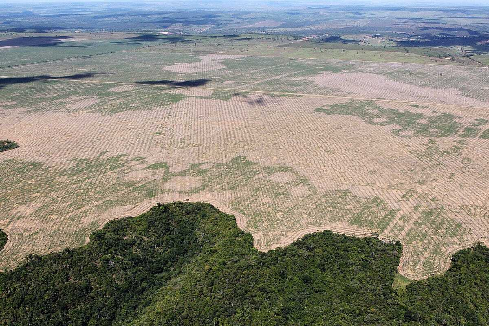
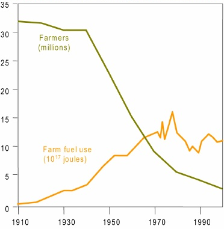
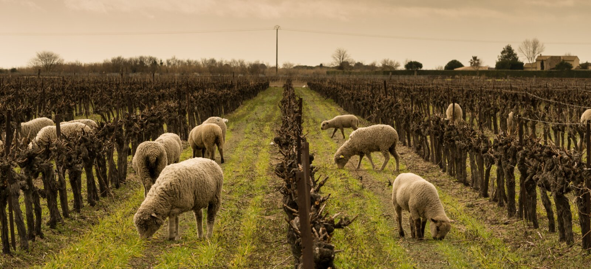

Ceci est le premier article d’une série d’articles sur Neayi. Nous voulons ici expliquer le contexte agricole tel que nous le percevons, en France et dans le monde. C’est la raison pour laquelle nous avons décidé de créer Neayi, afin d’apporter un début de réponse aux formidables défis que nous y voyons.

Mise à jour (24 juin 2019) — [Le deuxième article de cette série est ici](/a-propos/notre-proposition/)!

---

## L’agriculture traverse une crise multi-forme

Pollution, crise de confiance, risques sanitaires, endettement, normes, disparition des espèces, prise de conscience des ressources limitées de ce monde… Les solutions à ces problèmes se croisent en s’entrechoquant. Par exemple, la crise de la vache folle a stoppé net l’alimentation du bétail en farines animales, [générant une gigantesque demande en soja](http://www.agrobiosciences.org/IMG/pdf/Cahier_alimentation_betail.pdf) et en maïs (deux des plantes les plus énergétiques au kg), conduisant à une [déforestation massive](http://www.fao.org/americas/noticias/ver/en/c/425600/) des forêts primaires d’Amérique du Sud.

*Déforestation de la forêt amazonienne*

Déforestation qui est à l’origine d’[augmentation des émissions de CO2](https://www.carbonfootprint.com/deforestation.html), s’ajoutant à celles de méthane ([ruminants](https://www.cairn.info/revue-management-et-avenir-2008-6-page-259.htmuany), [riz](https://www.lexpress.fr/actualite/societe/environnement/gaz-a-effet-de-serre-les-rizieres-ces-grandes-pollueuses_2034677.html)), et de protoxyde d’azote (engrais), respectivement 30 et [300 fois plus puissantes](https://fr.wikipedia.org/wiki/Protoxyde_d%27azote#Contribution_%C3%A0_l'effet_de_serre) que le CO2 quant à leur pouvoir réchauffant. Au total, l’agriculture mondiale est à l’origine de [24% des émissions totales de gaz à effet de serre](https://www.ipcc.ch/site/assets/uploads/2018/02/ipcc_wg3_ar5_summary-for-policymakers.pdf) qui conduisent au réchauffement climatique.

<figure class="chart">
  <iframe src="https://embed.chartblocks.com/1.0/?c=5c7e3cd73ba0f6c6504d7fbc&t=1d4478e686ba801" title="Origine des émissions de GES" loading="lazy" width="800" height="450"></iframe>
  <figcaption>Origine des émissions de GES <a href="https://reporterre.net/Climat-l-agriculture-est-la-source">https://reporterre.net/Climat-l-agriculture-est-la-source</a></figcaption>
</figure>

Ce réchauffement, on le sait maintenant, fait porter une grave menace en retour sur notre agriculture : sécheresses, inondations, grêle, printemps précoces suivis de gel, migrations de ravageurs, nouvelles maladies. Chaque degré supplémentaire fait baisser les [rendements au niveau mondial de 7%](http://www.lafranceagricole.fr/actualites/cultures/rechauffement-climatique-les-rendements-sur-le-gril-1,1,4206923545.html).

Une baisse de rendement, qui en parallèle se confronte à une augmentation de la population mondiale (de 7 aujourd’hui à [9 milliards](https://en.wikipedia.org/wiki/Projections_of_population_growth) d’habitants d’ici 2030), nécessitant une augmentation de la production d’au moins 30 à 50%. De plus, certains pays comme la Chine, du fait de l’augmentation de leur niveau de vie, changent radicalement leur alimentation et se tournent vers des régimes beaucoup plus riches en protéines.

On prévoit que d’ici 2030 la fonte des glaciers de l’Himalaya mette à sec durant plusieurs mois chaque année [10 des plus grands fleuves du monde](https://www.lepoint.fr/monde/les-deux-tiers-des-glaciers-de-l-himalaya-pourraient-fondre-d-ici-a-2100-etude-04-02-2019-2291217_24.php) (notamment le Gange, l’Indus, le Fleuve Jaune, le Mékong), qui approvisionnent directement à la fois l’agriculture et l’alimentation hydro-électrique de plusieurs milliards de personnes.

Comme entre le marteau et l’enclume, les populations qui ne seront pas touchées par les sécheresses le seront par les inondations. Par exemple, au Bangladesh, la montée des eaux va supprimer [20% du territoire](https://www.letemps.ch/monde/face-changement-climatique-bangladesh-nest-pret), conduisant à des migrations massives de ses habitants vers les pays voisins.

*[Nombre de fermiers aux USA, et consommation de pétrole en agriculture](https://www.postcarbon.org/publications/food-and-farming-transition/), entre 1910 et 2000*

Les menaces ne viennent pas que du réchauffement climatique. Le pic pétrolier, signalant le début de la fin du pétrole, a eu lieu en [2006 en Europe](https://jancovici.com/transition-energetique/petrole/a-quand-le-pic-de-production-mondial-pour-le-petrole/) sur le pétrole conventionnel et devrait intervenir d’ici 2030 pour l’ensemble des hydrocarbures. L’industrie agricole est extrêmement dépendante de l’utilisation des énergies fossiles, que ce soit pour la production puis l’épandage des engrais et pesticides, pour le travail du sol, le stockage et le transport des matières premières. Il faut environ [1 500 litres de pétrole pour « produire » une vache de 500 kg](https://www.postcarbon.org/publications/food-and-farming-transition/). Sans pétrole, ou même simplement avec un pétrole dont le prix aurait doublé, nous ne savons absolument pas maintenir notre système alimentaire.

Au delà du pic du pétrole, le [pic du phosphore](https://www.cairn.info/revue-d-economie-du-developpement-2015-3-page-5.htm) pointe son nez. Le phosphore fait partie des trois molécules indispensables à la croissance des plantes (avec l’azote et le potassium). Sans phosphore, pas d’agriculture. Mais [le phosphore n’a pas d’équivalent “renouvelable”](https://www.ted.com/talks/mohamed_hijri_a_simple_solution_to_the_coming_phosphorus_crisis). Si nous ne trouvons pas une solution pour optimiser son utilisation (aujourd’hui seul 15% des phosphates épandus sur les terres agricoles finissent dans les plantes, le reste va dans les [rivières et les lacs](https://fr.wikipedia.org/wiki/Eutrophisation), à l’origine de nouvelles pollutions aux algues bleues en particulier), notre système de production de nourriture sera condamné.

Le manque d’eau enfin, pour laquelle le niveau des [nappes phréatiques ne cesse de baisser](http://www.unwater.org/water-facts/scarcity/), constitue une menace de plus en plus préoccupante, en particulier dans les pays dont les démographies sont les plus galopantes.

## Face à ces constats, les agriculteurs en France se divisent

L’agriculture conventionnelle, fidèle au modèle imposé par la politique européenne de l’après guerre, continue de remplir son contrat : produire un maximum. Mais elle fonctionne dans un cadre toujours plus réglementé, limitant d’un côté les options en terme de traitements autorisés, de l’autre les options d’innovation, largement dépendantes de l’endettement et des aides spécifiques qui peuvent lui être accordées. La défiance généralisée des consommateurs envers l’industrie agro-alimentaire, ainsi que le manque de support et de compréhension des problématiques de la part des responsables politiques, conduisent à un climat délétère dans lequel plus personne ne s’écoute.

L’agriculture bio, enfant des abus de l’industrie agro-chimique, tente de définir un nouveau modèle en opposition au premier. Cependant les rendements limités, la sensibilité aux ravageurs et aléas climatiques, l’immense complexité de cette lutte avec des produits naturels, mais aussi moins précis et moins efficaces, font dépendre cette agriculture des aides et des subventions. Quand ces aides tardent à venir, comme c’est le cas [depuis plusieurs années maintenant](https://www.bioaddict.fr/article/colere-et-desarroi-de-nombreux-agriculteurs-bio-attendent-le-versement-de-leurs-aides-depuis-4-ans-a6124p1.html), le système ne fonctionne plus.

Qu’elle soit conventionnelle ou bio, l’agriculture se heurte à une concurrence internationale [parfois déloyale](https://www.youtube.com/watch?v=VCcJFYRgqO0). Le conventionnel chez nos voisins ne souffre pas des limitations sur les OGM ou sur l’utilisation de certains produits. Le bio ne suit pas le même cahier des charges en Europe de l’Est et en France. En parallèle de l’interdiction programmée du glyphosate, [l’importation de soja et de maïs](https://www.consoglobe.com/soja-americain-accord-importations-ue-cg), augmente au travers des accords de libre-échange. Soja et maïs issus de plants OGM sur lesquels le glyphosate est épandu directement (augmentant la quantité de résidus), sur des terres issues de la déforestation.

Les attentes des consommateurs sur ces questions ne sont pas toujours accompagnées des changements de comportements en cohérence. Les habitudes créées sur les quarante dernières années (avoir des fruits et légumes de tous les pays, en toute saison, avec une couleur et un aspect irréprochable, pour un prix toujours plus faible) sont compliquées à changer. A l’instar des vaccins, la sécurité sanitaire que nous prenons pour acquise nous fait douter de la pertinence de certains additifs (par exemple des nitrites, ajoutés pour éviter les bactéries du botulisme, de la listériose ou de la salmonellose).

## Une évolution nécessaire des pratiques agricoles devra avoir lieu

[On dit](https://www.lemonde.fr/politique/article/2018/10/18/comment-le-glyphosate-empoisonne-la-vie-des-deputes-lrm_5371079_823448.html) que le secteur agricole est lent à changer. On se trompe cependant sur les causes de cette lenteur. Il ne s’agit pas du manque de volonté ou d’entrepreneuriat des agriculteurs. Ceux-là n’ont pas attendu les préconisations du gouvernement pour s’adapter, rechercher de nouvelles manières de faire, en témoignent les initiatives des systèmes bio, agro-écologiques, permacoles ou d’agroforesterie.

Ce qui est lent à changer, c’est le sol et le système cultural. Il faut [plusieurs années pour changer un sol](http://archive.wikiwix.com/cache/?url=http%3A%2F%2Fwww.vol.be.ch%2Fsite%2Ffr%2Flanat-3155-mbbodenbiologie.pdf), ou pour passer d’un système à un autre. De même, il faut plusieurs saisons pour tester une nouvelle pratique et savoir si elle est efficace. En effet, entre l’apprentissage dans la mise en place et les aléas climatiques (sécheresse une année, inondations la suivante), on ne peut valider la pratique sur une seule année.

Par ailleurs, quand une exploitation est endettée, supportant des charges financières lourdes (salaires, machines, produits phytosanitaires, engrais, énergie), il est normal que le premier trait de caractère qui s’exprime soit la prudence.

On rêve de solutions technologiques qui viendraient miraculeusement régler un à un chacun des problèmes. De fait, l’innovation digitale, agronomique, voire économique, ne manque pas. Par exemple, face au problème du phosphore, l’utilisation de mycorhize peut être vue avec raison comme une solution miracle.

> ***Cependant, il serait naïf de croire que la technologie seule réglera tous les problèmes, sans adaptation des comportements des consommateurs, de la régulation, et des pratiques agricoles.***

## Quelles pratiques favoriser ?

Il est complexe de définir ce qui caractérise une bonne pratique. Est-ce son caractère écologique ? Est-ce le caractère économique, le rendement amélioré ? Est-ce le caractère sanitaire ? La consommation en eau, en énergie ?

Par ailleurs, il est clair que dans les 10 ou 20 années qui viennent, peu de gens savent dans quel contexte nous devrons nous nourrir. La résilience, cette capacité à s’adapter aux changements des conditions de production (climatiques, ravageurs, …), deviendra un maître mot. Elle est en général synonyme de variété (des cultures, mais aussi des systèmes), et de simplicité. Une agriculture résiliente sera forcément le résultat de nombreuses pratiques gagnantes dans certains contextes, et perdantes dans d’autres, mais globalement capables de nous nourrir.

Nous croyons que l’agriculture de demain sera composée de multiples systèmes, que pour la façonner, chacun y mettra sa patte et son innovation ([désherber entre les vignes avec des moutons ou avec des poules](https://www.bordeaux.com/fr/Bordeaux-Magazine/Journal/Education/Une-viticulture-qui-renoue-avec-la-nature) ? Quel type de haies pour quelle taille de parcelle ? Repiquer les plants de riz au bout de [8 jours plutôt que 30](https://fr.wikipedia.org/wiki/Syst%C3%A8me_de_riziculture_intensive) ? Mettre des noyers au dessus des pommiers ?).

Nous croyons surtout qu’au travers de la collaboration, de l’échange sur les techniques et sur les retours d’expérience, de nouvelles idées puissantes peuvent germer.

Nous sommes convaincus que le monde agricole est prêt à relever ce défi, et qu’il n’y a pas plus passionné qu’un agriculteur quand il s’agit d’imaginer de nouvelles manières de faire son métier.

Nous sommes certains que le monde agricole est prêt à changer, témoigner, apprendre et échanger, dès lors qu’on lui donne les moyens de le faire, sur fond de confiance et de bienveillance, plutôt que d’idées préconçues et de défiance.

Nous pensons que les solutions techniques, quelle qu’en soient la nature, ne sont que des outils. Ce qui importe c’est la finalité et la manière d’utiliser ces solutions.

Notre objectif est donc de faciliter le partage de toutes les pratiques et innovations qui permettent et permettront une agriculture encore plus performante et plus respectueuse de la nature, et de ses ressources qui sont par essence limitées.

Mise à jour (24 juin 2019) — [Le deuxième article de cette série est ici](/a-propos/notre-proposition/)!

